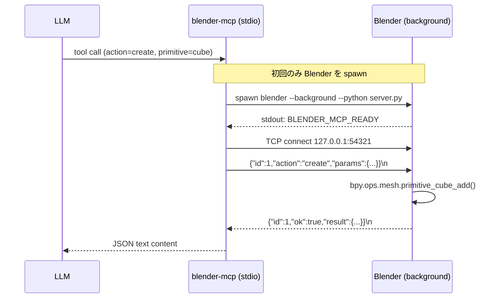

<div align="center">

# blender-mcp

### Blender を永続ヘッドレス化する Model Context Protocol サーバー

[](src/index.ts)
[](package.json)
[](https://www.blender.org/)
[](https://modelcontextprotocol.io/)
[](LICENSE)

**LLM から Blender Python API を直接叩く。プロセス常駐で起動コスト 0。**

---

</div>

## 概要

`blender --background --python -c "..."` を毎回叩く素朴な MCP は、毎回数秒の起動コストを払うので実用にならない。このサーバーは Blender を**一度だけ起動し、ソケット経由で Python を送り込み続ける**事で、2回目以降の操作を体感ゼロで動かす。

| 要素 | 実装 |
|---|---|
| トランスポート | stdio MCP |
| 子プロセス | `blender --background --python blender/server.py` |
| 橋渡し | localhost TCP + 改行区切り JSON |
| スクリプト層 | TypeScript (MCP SDK) ↔ Python (`bpy`) |
| ライフサイクル | 初回ツール呼び出しで起動、MCP 終了で自動停止 |

## 特徴

| アクション | 用途 |
|---|---|
| `execute` | 任意の Python を Blender 内で実行。`_result = ...` で値を返す。stdout/stderr を捕捉 |
| `scene` | シーングラフを JSON でダンプ（オブジェクト・変形・マテリアル・メッシュ・コレクション） |
| `create` | プリミティブ追加（cube / sphere / ico_sphere / plane / cone / cylinder / torus / monkey / camera / light_* / empty） |
| `delete` | 名前でオブジェクト削除 |
| `transform` | location / rotation_euler (rad) / scale を設定 |
| `select` | 名前配列・all・none で選択状態を制御 |
| `material` | Principled BSDF マテリアルを作成/更新（color, metallic, roughness） |
| `render` | 現在のシーンをレンダリング（CYCLES / EEVEE_NEXT / WORKBENCH、解像度・サンプル数・カメラ・フレーム指定可） |
| `import_file` / `export_file` | `.obj` / `.fbx` / `.glb` / `.gltf` / `.stl` / `.ply`（`.dae` は import のみ） |
| `open` / `save` | `.blend` ファイルの読み込み / 保存 |
| `reset` | ファクトリリセット（空シーン） |

## 処理フロー



## インストール

```bash
git clone https://github.com/cUDGk/blender-mcp.git
cd blender-mcp
npm install
npm run build
```

Blender 4.2 以降が必要。インストール先は自動検出する（Windows の `C:\Program Files\Blender Foundation\Blender 4.x\blender.exe`、macOS の `/Applications/Blender.app`、Linux の `/usr/bin/blender` など）。見つからない場合は `BLENDER_PATH` 環境変数で明示する。

## 使い方

### Claude Code に登録

```bash
claude mcp add blender -- node C:/Users/user/Desktop/blender-mcp/dist/index.js
```

### 設定可能な環境変数

| 変数 | デフォルト | 用途 |
|---|---|---|
| `BLENDER_PATH` | 自動検出 | blender 実行ファイルの絶対パス |
| `BLENDER_MCP_PORT` | `54321` | 橋渡し用の localhost TCP ポート |
| `BLENDER_STARTUP_TIMEOUT` | `60000` | Blender 起動タイムアウト (ms) |
| `BLENDER_REQUEST_TIMEOUT` | `120000` | 単一リクエストのタイムアウト (ms) |

### 呼び出し例

シーン確認 → キューブ追加 → マテリアル設定 → レンダリング:

```json
{"action": "scene"}
{"action": "create", "primitive": "cube", "name": "Hero", "location": [0, 0, 1]}
{"action": "material", "object": "Hero", "color": [0.8, 0.2, 0.2], "metallic": 0.3, "roughness": 0.4}
{"action": "render", "output_path": "C:/tmp/out.png", "resolution_x": 1920, "resolution_y": 1080, "samples": 64, "engine": "CYCLES"}
```

宣言的アクションでカバーできない操作は `execute` に落とす:

```json
{
  "action": "execute",
  "code": "import bpy\nfor o in bpy.data.objects:\n    if o.type == 'MESH':\n        o.scale = (2, 2, 2)\n_result = len(bpy.data.objects)"
}
```

## 設計メモ

- **永続プロセス**が本 MCP の価値。素朴な `blender --python-expr` ラッパーが数秒×呼び出し回数の税金を払うのに対し、こちらは初回起動後ほぼゼロ。
- **単一ツール + `action` 振り分け**で MCP クライアントのコンテキスト消費を抑える（ツール定義は 1 枚）。
- **`execute` はエスケープハッチ**。宣言的アクションで綺麗に表現できる操作だけ個別化し、それ以外は `bpy` を直接叩かせる方針。
- **`--background` モード**で動かす為、GUI オペレータ依存のコード（モーダルダイアログ等）は動かない。レンダリング・IO・メッシュ編集・モディファイアは問題なし。

## Attribution

- [Blender](https://www.blender.org/) © Blender Foundation（GPL）— 本 MCP はラッパーであり Blender 本体のライセンスに従う
- [Model Context Protocol](https://modelcontextprotocol.io/) — 仕様・SDK

## ライセンス

MIT License © 2026 cUDGk — 詳細は [LICENSE](LICENSE) を参照。
